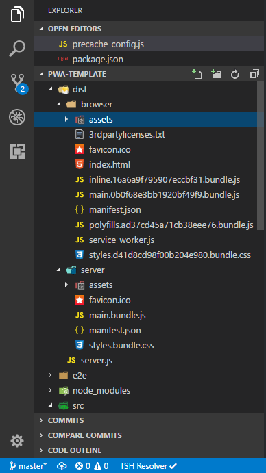
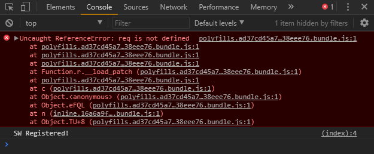

# Angular v5 SSR and PWA template

## Prerequisites

* node.js ( stable version )
* @angular/cli@latest ( 1.5.0 )
* @angular v5

```
"dependencies": {
  "@angular/platform-server": "^5.0.0"
  "@nguniversal/express-engine": "5.0.0-beta.5"
  "@nguniversal/module-map-ngfactory-loader": "5.0.0-beta.5"
  "ts-loader": "^3.1.1"
},
"devDependencies": {
  "sw-precache-webpack-plugin": "^0.11.4"
}
```

## Production Build and Serve

* normal: `ng build` or `ng build --prod` or `ng build --prod --build-optimizer`
* normal: `ng serve --aot`

* server side rendered: `npm run build:universal`
* generate service worker: `npm run pwa`
* serving server side rendered: `npm run serve:universal`



```
"scripts": {
  "...": "..."
  "build:universal": "npm run build:client-and-server-bundles && npm run webpack:server",
  "serve:universal": "node dist/server.js",
  "build:client-and-server-bundles": "ng build --prod --build-optimizer && ng build --prod --build-optimizer --app 1 --output-hashing=false",
  "webpack:server": "webpack --config webpack.server.config.js --progress --colors",
  "pwa": "sw-precache --root=dist/browser --config=precache-config.js",
  "pwa:dev": "ng build --prod && sw-precache --root=dist --config=precache-config.js"
}
```

## Error or Bug

If you ever encounter this error


Here is the issue link: https://github.com/angular/angular-cli/issues/8359

## Running unit tests

Run `ng test` to execute the unit tests via [Karma](https://karma-runner.github.io).

## Running end-to-end tests

Run `ng e2e` to execute the end-to-end tests via [Protractor](http://www.protractortest.org/).

## Reference

* https://angular.io/guide/universal
* https://angularfirebase.com/lessons/installable-angular-progressive-web-app/
